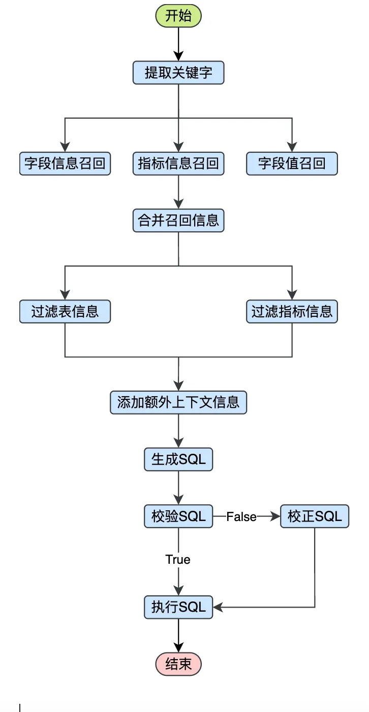

# data-agent

基于 **FastAPI + LangGraph** 的“数据问答 / Text2SQL Agent”服务：输入自然语言问题，Agent 会完成关键词抽取、维表/字段召回、指标召回、上下文拼装、SQL 生成与校验、SQL 执行，并通过 **SSE（Server-Sent Events）** 流式输出推理过程与结果。

该项目同时提供“元知识库构建”能力：将 `conf/meta_config.yaml` 描述的表/字段/指标元数据写入 **Meta MySQL**，并同步到 **Qdrant（向量检索）** 与 **Elasticsearch（字段值全文检索）**，以支持更稳定的语义召回。

## 特性

- **流式接口**：`POST /api/query` 以 SSE 持续输出 chunks
- **Agent 工作流**（LangGraph）：关键词抽取 -> 召回（字段/值/指标）-> 过滤 -> 生成 SQL -> 校验/纠错 -> 执行
- **多存储检索增强**：
  - Qdrant：字段与指标语义向量检索
  - Elasticsearch：字段值全文索引（按配置选择同步列）
  - MySQL：元数据（meta）与数据仓库（dw）
- **可压测**：内置压测脚本（支持 mock LLM 隔离外部网络波动）

## 系统架构（组件依赖）

服务启动入口：`main.py`（FastAPI）

- **API 层**：FastAPI router `app/api/routers/chat_router.py`
- **核心服务**：`app/service/chat_service.py`
- **Agent 图**：`app/agent/graph.py`
- **配置**：`conf/app_config.yaml`（运行配置），`conf/meta_config.yaml`（元数据示例）
- **依赖服务**：
  - MySQL（meta / dw）
  - Elasticsearch（字段值检索）
  - Qdrant（向量库）
  - Embedding 推理服务（HuggingFace `text-embeddings-inference`）

以上依赖均提供了 `docker/docker-compose.yaml` 便于一键启动。

## 环境要求

- Python: `>= 3.11`（见 `pyproject.toml`）
- 推荐使用 `uv` 管理依赖（仓库包含 `uv.lock`）

## 快速开始

### 1) 启动依赖服务（Docker Compose）

在仓库根目录执行：

```bash
docker compose -f docker/docker-compose.yaml up -d
```

默认会启动：

- MySQL: `localhost:3306`
- Elasticsearch: `localhost:9200`（以及 Kibana `localhost:5601`）
- Qdrant: `localhost:6333`
- Embedding: `localhost:8081`（容器端口 80 映射到本机 8081）

说明：Embedding 容器会从 `docker/embedding/` 挂载模型目录（见 compose 的 volumes 配置）。如果你本机没有对应模型文件，请先按你的环境准备好模型，或改为使用可拉取的镜像/模型挂载方式。

### 2) 配置应用

应用配置文件：`conf/app_config.yaml`

- **MySQL**：`db_meta` / `db_dw`
- **Qdrant**：`qdrant`
- **Embedding**：`embedding`（host/port/model）
- **Elasticsearch**：`es`
- **LLM**：`llm.model_name` / `llm.api_key`

注意：仓库示例配置中 `llm.api_key` 是占位符（例如 `sk-*****`）。开源前请务必替换为本地私密配置，避免泄露。

### 3) 安装依赖并启动 API 服务

#### 使用 uv（推荐）

```bash
uv sync
uv run uvicorn main:app --host 0.0.0.0 --port 8000
```

#### 使用 pip（可选）

本项目依赖在 `pyproject.toml` 中声明，你也可以用你自己的方式安装依赖并启动：

```bash
pip install -e .
uvicorn main:app --host 0.0.0.0 --port 8000
```

## 构建元知识库（首次运行建议执行）

元数据示例位于：`conf/meta_config.yaml`（包含 tables/columns/metrics 等结构化描述）。

构建脚本：`app/scripts/build_meta_knowledge.py`

```bash
uv run python -m app.scripts.build_meta_knowledge -c conf/meta_config.yaml
```

该脚本会：

- 写入 Meta MySQL（表/字段/指标等）
- 将字段与指标向量写入 Qdrant
- 将配置为 `sync: true` 的字段值写入 Elasticsearch（用于值检索）

## API 使用

### `POST /api/query`

- **Path**：`/api/query`
- **Body**：

```json
{"query": "统计一下2025年1月份各品类的销售额占比"}
```

- **Response**：`text/event-stream`（SSE），每个 event 形如：

```text
data: {"...": "..."}

```

#### curl 示例（查看流式输出）

```bash
curl -N \
  -H 'Content-Type: application/json' \
  -X POST 'http://localhost:8000/api/query' \
  -d '{"query":"统计一下2025年1月份各品类的销售额占比"}'
```

## 压测

压测脚本与说明文档位于：`test/README.md`。

- 依赖：`test/requirements.txt`（主要是 `httpx`）
- 支持：
  - 快速验证（连通性）
  - 阶梯压测（找瓶颈并发）
  - 稳压压测（长时间吞吐）
  - Mock LLM 压测（隔离外部 LLM API 网络波动）

按文档启动服务后，可直接运行：

```bash
python -m test.load_test --quick
```

## 目录结构

```text
.
├── app/
│   ├── agent/                 # LangGraph 工作流、节点与状态定义
│   ├── api/                   # FastAPI routers / dependencies
│   ├── clients/               # MySQL / ES / Qdrant / Embedding 客户端
│   ├── config/                # 配置 dataclass + OmegaConf loader
│   ├── core/                  # lifespan/middleware/logging/context
│   ├── models/                # MySQL/ES/Qdrant 数据模型
│   ├── prompt/                # Prompt 管理
│   ├── repositories/          # 存储层封装（MySQL/ES/Qdrant）
│   ├── schemas/               # API schema
│   ├── scripts/               # 运维/构建脚本（如 build_meta_knowledge）
│   └── service/               # ChatService / MetaKnowledgeService 等
├── conf/
│   ├── app_config.yaml        # 运行配置（DB/ES/Qdrant/Embedding/LLM）
│   └── meta_config.yaml       # 元数据示例（tables/columns/metrics）
├── docker/
│   └── docker-compose.yaml    # 依赖组件一键启动
├── prompts/                   # SQL 生成/纠错等 prompt 模板
├── test/                      # 压测脚本与 mock server
├── main.py                    # FastAPI 应用入口
├── pyproject.toml
├── uv.lock
└── LICENSE
```

## Agent流程图



## 常见问题（FAQ）

- **接口一直卡住没有返回？**
  - 本服务为 SSE 流式输出，客户端需要以流的方式读取（例如 `curl -N`）。
- **如何替换/隔离 LLM？**
  - 压测文档里提供了 mock LLM 的方式（见 `test/README.md`）。

## License

本项目采用 [Apache License 2.0](./LICENSE)。

